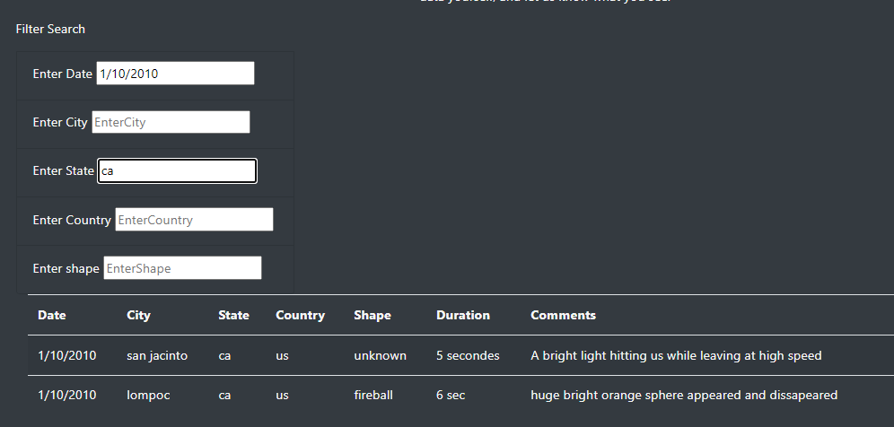
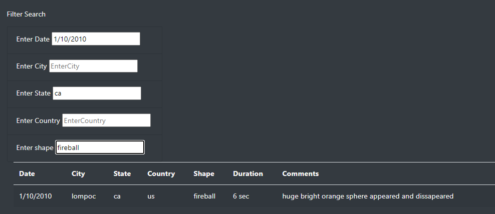

# UFO-Javascript

Background and Task
Dana is a data journalist who would like to write about her hometown McMinnville, Oregon. McMinnville is famous for its sightings of UFOs. My task it to use a Javascript file containing lots of UFO sighting data to create a webpage. This web page will include an article and data to support findings. Users will be able to interact with the web page by filtering for multiple criteria to obtain specific information on UFO Sightings.  

Results:
The webpage can be accessed by opening the index.html document in this repository. Once on the page, input the date, city, state, country, and/or shape values into the respective filters boxes. Press enter on your keyboard and the UFO Sightings data will be generated in the table to the right.
Image of input into filters box, image of input in shape state, showing the table generated.

Summary:

Drawback
One drawback of this webpage is that there are only a few filtering criteria that would succesffuly return output since the dataset has specific dates, cities, shapes etc. This would create frustration for the user during the search and filtering process.

Two additional recommendation for further development:
1) It would be better to have a dropdown menu for the filters to give specific dates, cities, states, and shapes for the user to filter from. This would ensure that each time they search, there is data generated in the data table.
2) Another recommendation for further development is to automatically generate visualizations based on the data, to visuually display the duration, number of sightings, and shape of the sighting.
